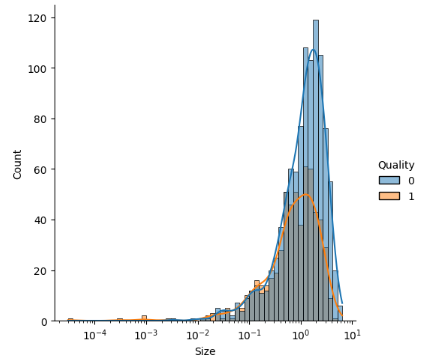
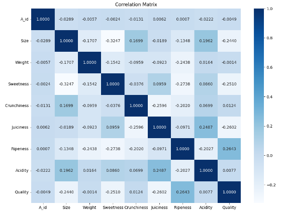
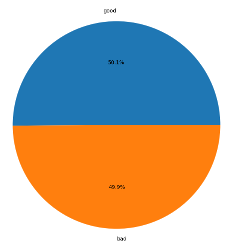

# Apple Quality Detection Project : Project Overview
* Created a deep learning project that tends to detect bad quality apples according to their natural characteristics using autoencoders technique with a recall score that equals to 34.73 % and an accuracy score of 54.5 %.
* Collected data to work with from kaggle (a dataset named `Apple Quality` within Datasets section).
* Cleaned data up and engineered features so they will help us in the prediction process like standardizing & normalizing numerical features.
* Built an autoencoder from scratch that consists of two parts (Encoder & Decoder) to feed it with our data and try to get the best performance ever from our model.

## Code and Resources used
<b>Python Version :</b> 3.9 
<b>Packages :</b> Numpy, Pandas, Matplotlib, Seaborn, Scikit-learn, TensorFlow 
<b>For Web Framework Requirements :</b> `pip install -r requirements.txt`

## Data Collection
Collect data from kaggle website to get a dataset that has 4000 apples. With each apple, we got the following :
* Apple ID
* Apple Size
* Apple Weight
* How much sweet an apple is
* How much crunchy an apple is
* How much juicy (contains a lot of Juice) an apple is
* How much ripe (arriving at such a stage of growth or development as to be ready for reaping) an apple is
* How much acidic an apple is (Its Juice is acidic)
* Apple Quality (Whether it's good or bad)

## Data Cleaning
Clean the data up to make it ready for modeling process. I made the following changes:
* Encoded target variable and transform its data type from an object to be numerical using a simple mapping method
* Standardized float features using a standard scaler

## EDA with Data Visualization (Matplotlib & Seaborn)
I looked at the distributions of the data, calculated and visualized Pearson's correlation coefficient between all variables and explored the value counts for the target variable (which is the only categorical variable in the dataset) to extract insights and patterns that could be useful in the rest of the project. Below are some of the visualizations I made:   
 
 

